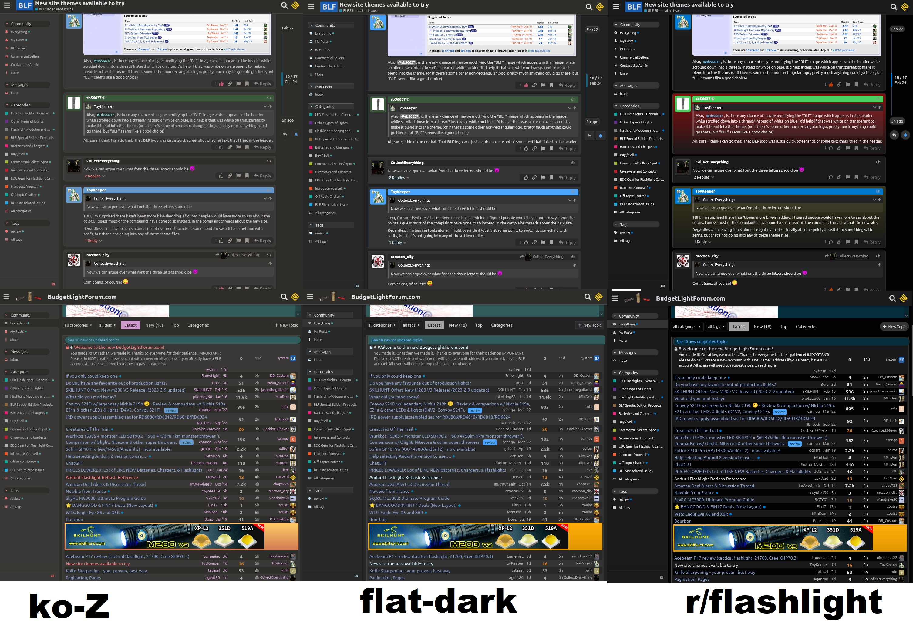

# BLF Themes

A collection of themes to use on the new (2023-02) BudgetLightForum site, now
running Discourse instead of Drupal.

These are intended to be used on the server eventually, but during development
they are merely css overrides to put into a browser extension like Stylus. 

Adjustments to TK's themes - includes flat-dark, a modern dark therme, ko-Z, a sift grey theme, and Reddit, which mimics Reddit's dark theme

